# Kelompok B-18

## Daftar Anggota

| NPM          | Nama                                   |
|--------------|----------------------------------------|
| 2006482584   | Adam Ghaviyasha                        |
| 2406362860   | Muhammad Lanang Zalkifla Harits        |
| 2406404913   | Zita Nayra Ardini                      |
| 2406495760   | Raihana Auni Zakia                     |

# Group Software Architecture

## Current Architecture of the Application (C4 Diagram) - Deliverable G.1

### Context Diagram
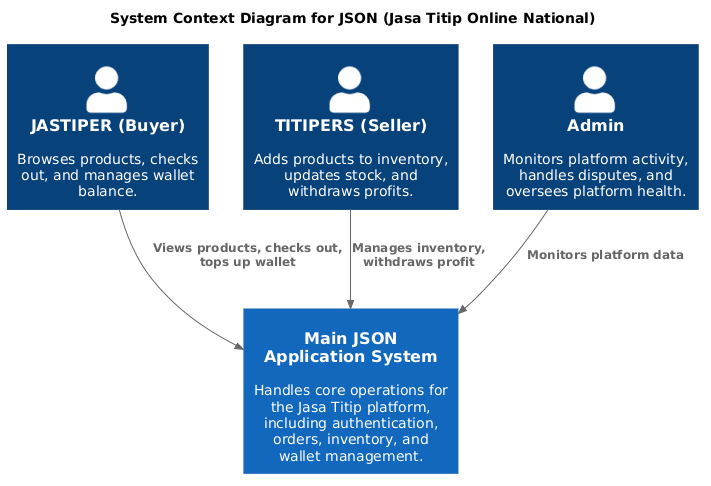

### Container Diagram
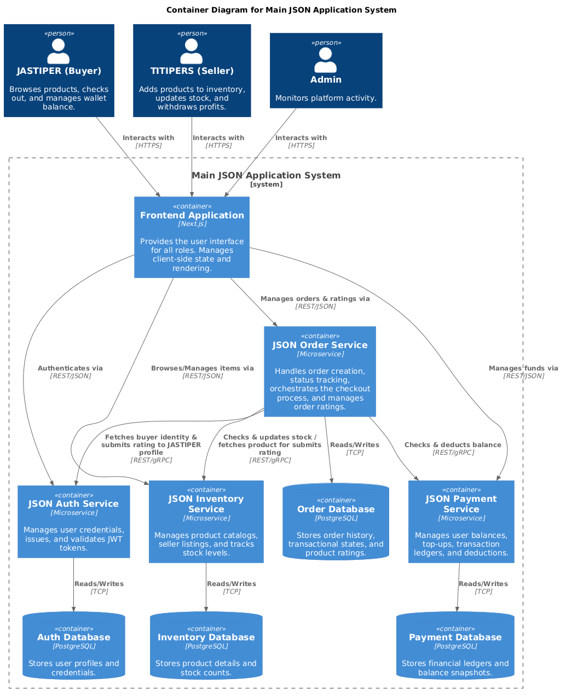

### Deployment Diagram
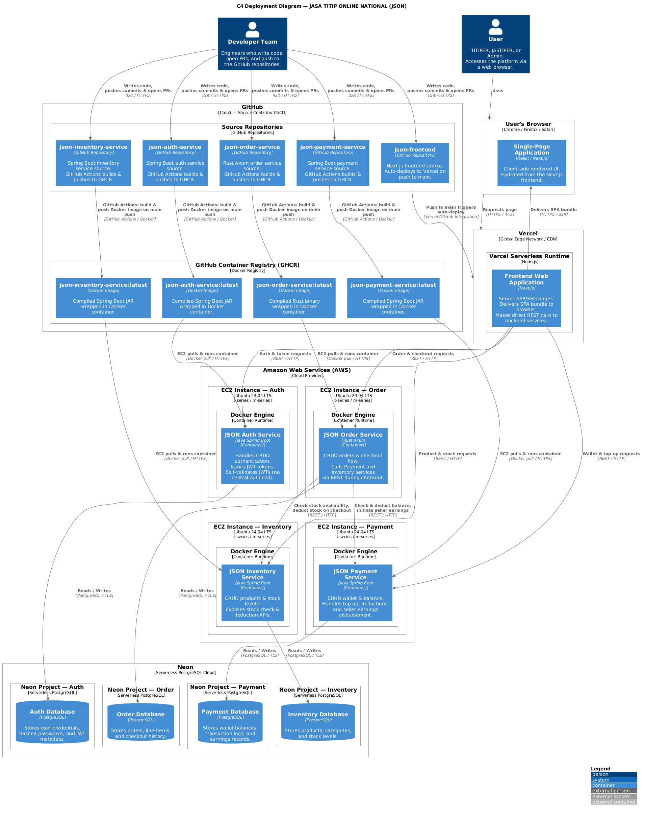

---

## Future Architecture - Deliverables G.2

### Context Diagram
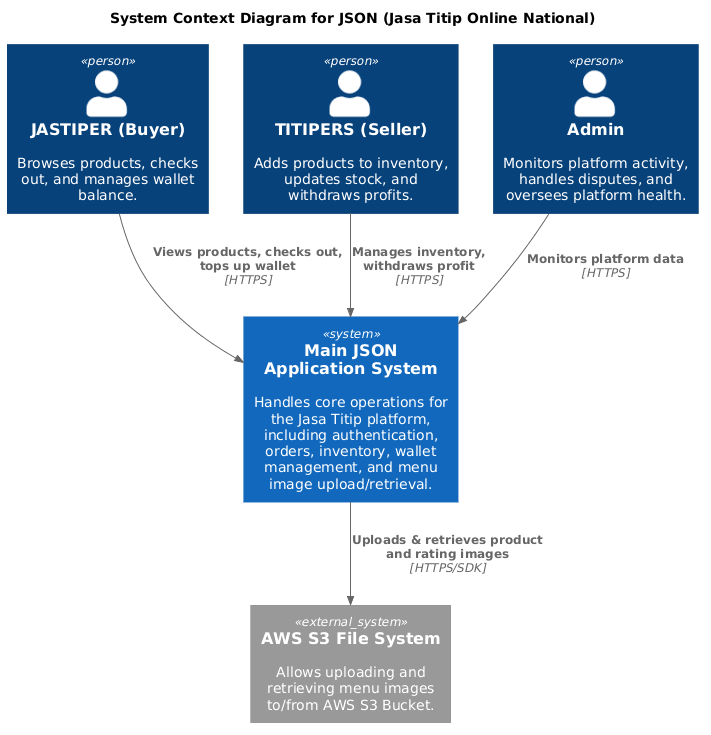

### Container Diagram
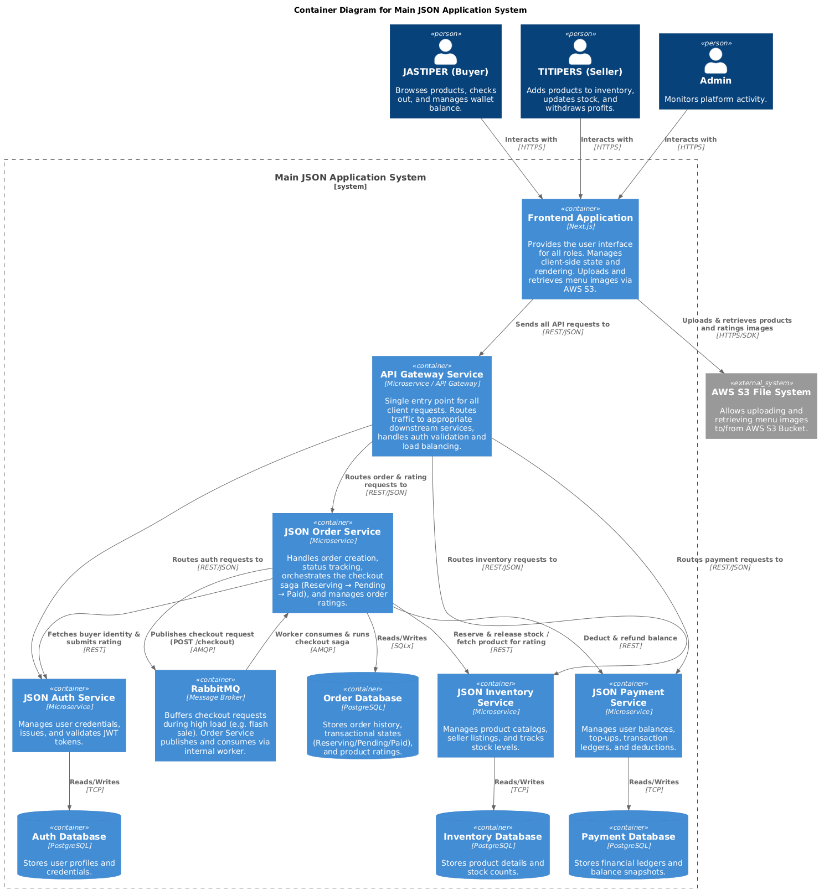

### Deployment Diagram

---

## Risk Mitigation - Deliverables G.3

### Why the risk storming technique is applied?
Teknik Risk Storming diterapkan pada arsitektur microservice JaStip Online Nasional atau JSON untuk menemukan dan menangani kerentanan sistem. Pada tahap identification, setiap anggota kelompok meninjau arsitektur saat ini dan memetakan potensi masalah. Setelah itu, kelompok kami berdiskusi dan mencapai consensus untuk memprioritaskan dua risiko utama. Pertama, terdapat risiko keamanan yang kritis karena ketiadaannya API Gateway, sehingga layanan internal terekspos langsung ke traffic eksternal dan rentan terhadap serangan bot. Kedua, ada risiko performa dan scalability yang tinggi saat terjadi lonjakan traffic secara tiba-tiba seperti pada momen flash sale. Jika proses request checkout dari pengguna dilakukan secara synchronous langsung ke masing-masing service, sistem menjadi sangat rentan mengalami bottleneck dan cascading failure.

Pada tahap mitigation, kami memodifikasi arsitektur dengan menambahkan API Gateway Service dan message broker RabbitMQ. API Gateway ditempatkan di posisi paling depan sebagai single entry point yang bertugas menangani routing request dan validasi autentikasi, sehingga layanan backend terlindungi dari akses langsung. Selanjutnya, RabbitMQ diintegrasikan pada JSON Order Service untuk melakukan buffering terhadap request checkout. Meskipun modifikasi ini menambah kompleksitas deployment awal, justifikasinya sangat kuat karena RabbitMQ memungkinkan proses checkout berjalan secara asynchronous melalui mekanisme orchestrating checkout saga. Dengan cara ini, sistem dapat menampung dan mengantrikan pesanan secara aman saat terjadi lonjakan flash sale tanpa membebani database secara langsung. Secara keseluruhan, modifikasi arsitektur ini memastikan platform tetap aman, responsif, dan highly available.

### Risk Matrix
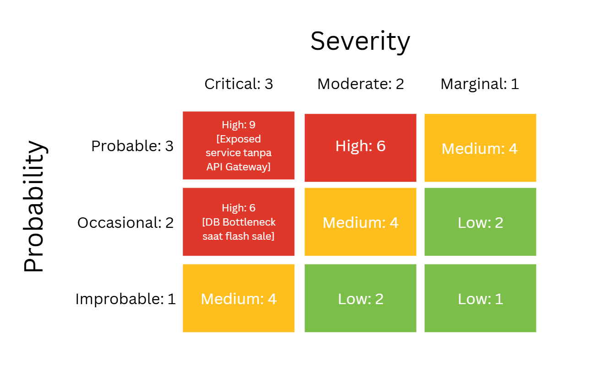

### Current Deployment Risk Diagram
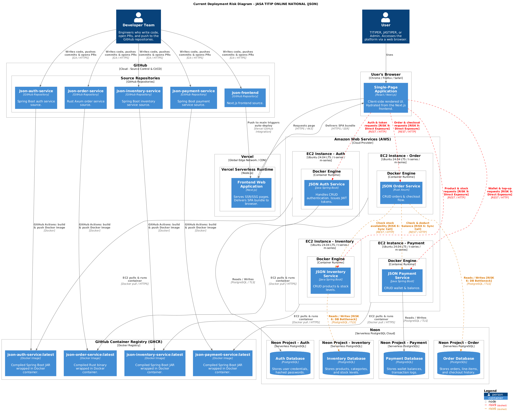

---

## Individual Work

### Order Service
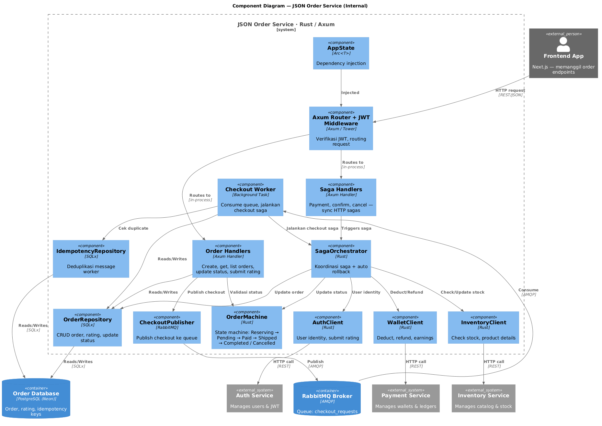
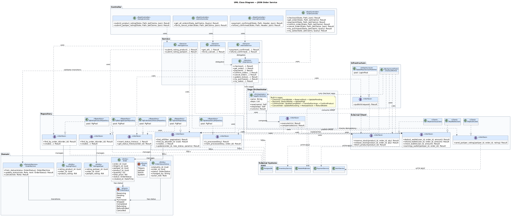

### Inventory Service
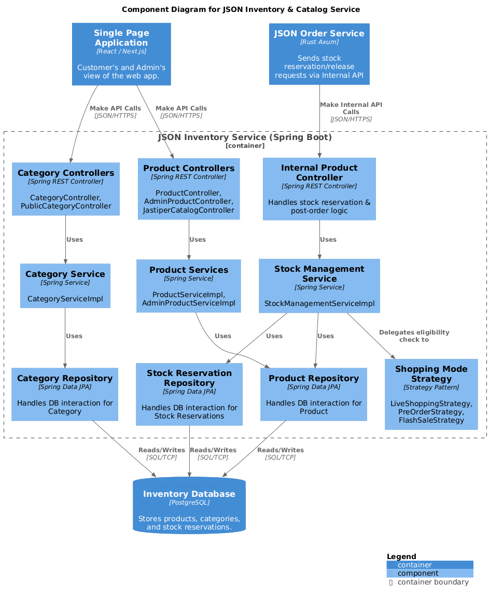
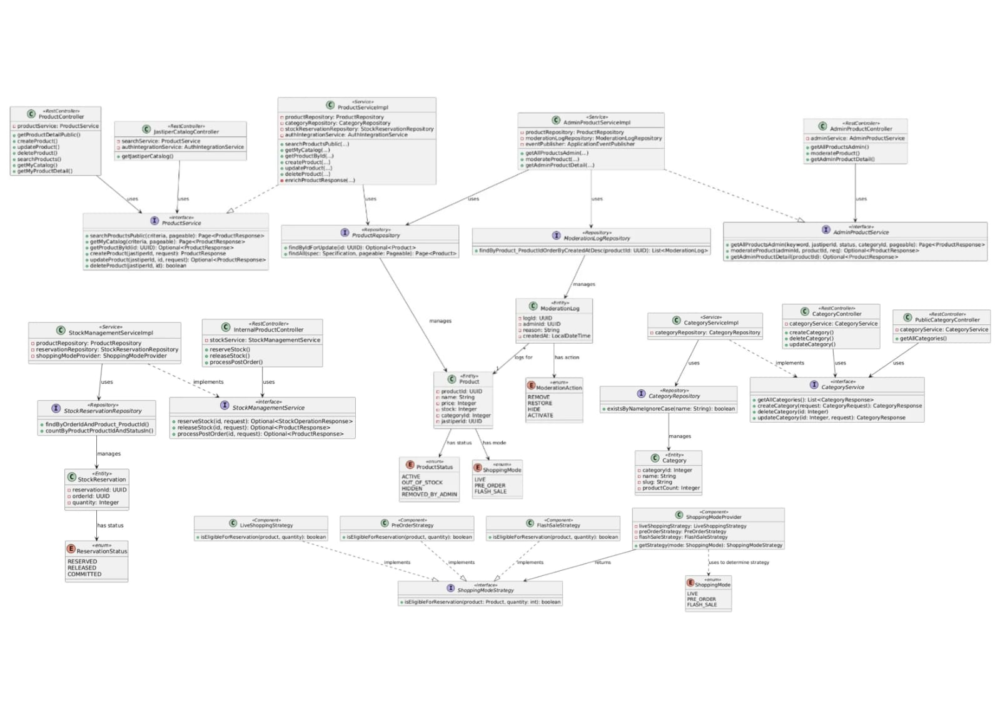

### Payment Service
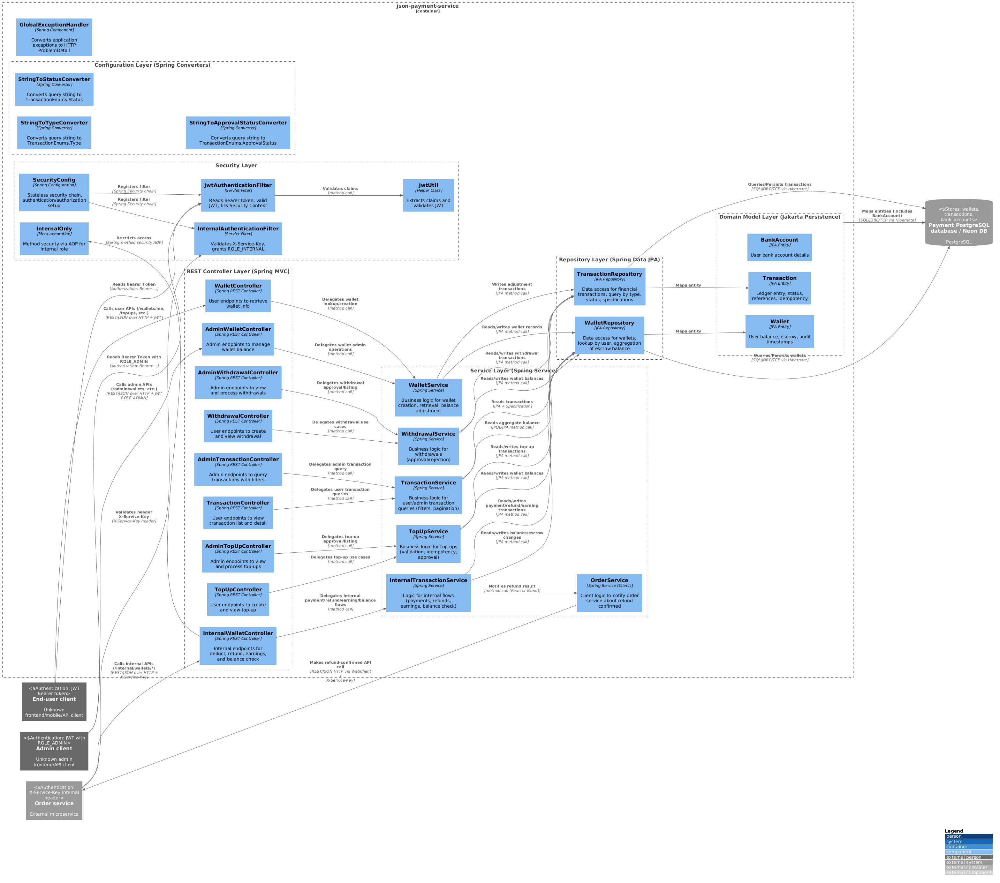
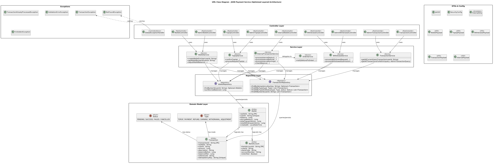